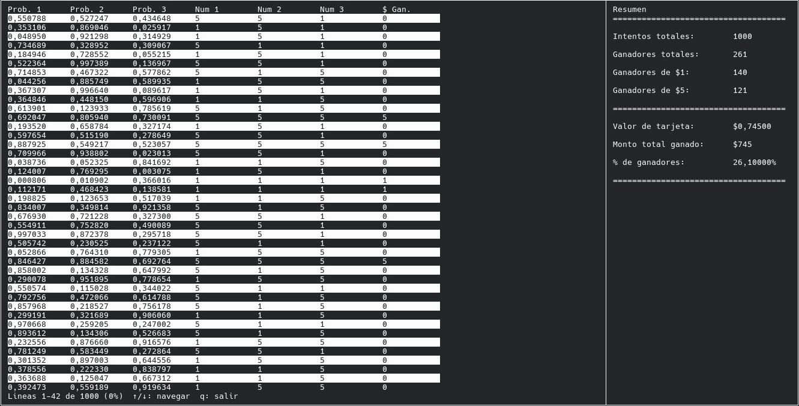

# mtsd-simulador01

<div align="center">



</div>

## Modo de uso

```
./raspar -m <intentos>
```


Para compilar el simulador con gcc:

```
gcc main.c raspar.c vista.c -o raspar -lncurses -lpthread
```

Los binarios precompilados se encuentran en [este link](https://github.com/mnomico/mtsd-simulador01/releases).